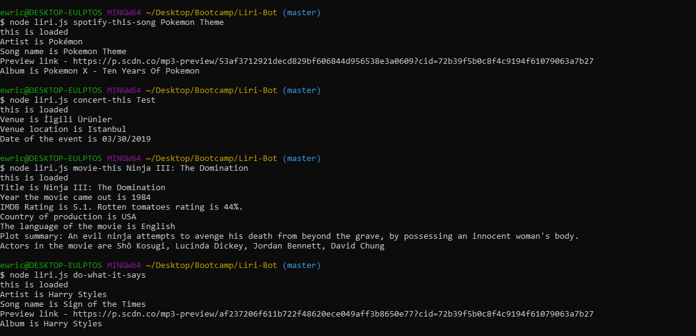

# Liri-Bot

This JS file takes in values from the command line and runs different searches.

*****Example of all functionality*****

Functions - this should be the first argument after the file name

**concert-this** - Searches for the next concert for a given band.  Will not work if band is not touring

**spotify-this-song** - Searches for a song, pulls the first song returned by spotify

**movie-this** - Searches for a movie with the given name

**do-what-it-says** - reads the random.txt file for a command (any of the three above) and executes accordingly

